```python
import graph_tool.all as gt
import networkx as nx
from nx2gt import nx2gt
import pickle
import numpy as np
```

## Data import


```python
g_true = gt.load_graph_from_csv('data/weeplace_friends.csv', skip_first=True, directed=False, hashed=True)
```


```python
g_threshold = gt.load_graph_from_csv('data/weeplace_artifical_friend_threshold_gt.csv', skip_first=True, directed=False, hashed=True)
```


```python
g_all = gt.load_graph_from_csv('data/weeplace_artifical_friend_all_gt.csv', skip_first=True, directed=False, hashed=True)
```

## Network visualisation

### True friendship network


```python
# true friendship network
gt.graph_draw(g_true)
```


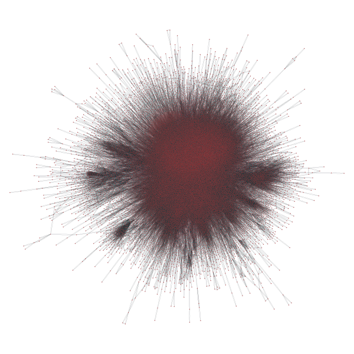


    <VertexPropertyMap object with value type 'vector<double>', for Graph 0x7fad4a6d94a8, at 0x7fad5857edd8>


```python
kcore_true = gt.kcore_decomposition(g_true)
gt.graph_draw(g_true, vertex_fill_color=kcore_true, vertex_text=kcore_true)
```


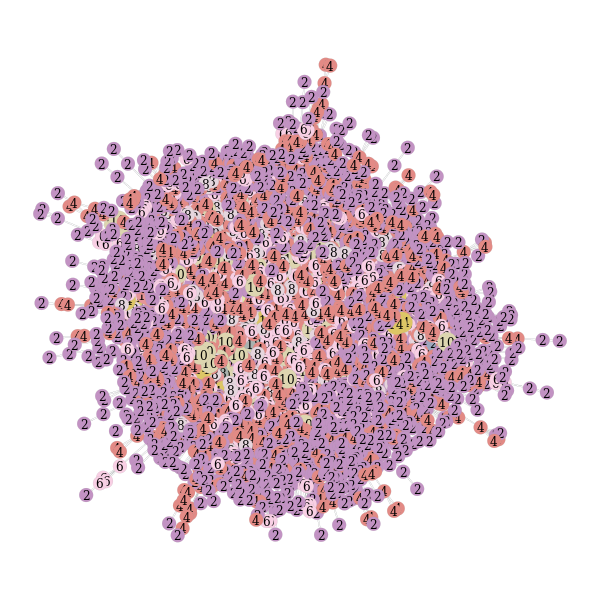


    <VertexPropertyMap object with value type 'vector<double>', for Graph 0x7fad4a6d94a8, at 0x7fad530c1a58>


```python
pos_true = gt.radial_tree_layout(g_true, g_true.vertex(0))
gt.graph_draw(g_true, pos=pos_true)
```


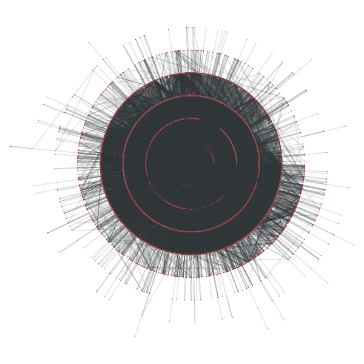


    <VertexPropertyMap object with value type 'vector<double>', for Graph 0x7fad4a6d94a8, at 0x7fad52f88860>


```python
state_true = gt.minimize_nested_blockmodel_dl(g_true, deg_corr=True)
gt.draw_hierarchy(state_true)
```


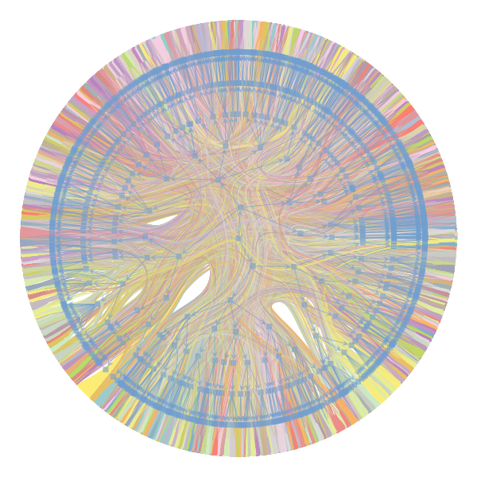


    (<VertexPropertyMap object with value type 'vector<double>', for Graph 0x7fad4a6d94a8, at 0x7fad4a4272e8>,
     <Graph object, directed, with 17039 vertices and 17038 edges at 0x7fad4a3ef6a0>,
     <VertexPropertyMap object with value type 'vector<double>', for Graph 0x7fad4a3ef6a0, at 0x7fad4a4274e0>)


### Artifical Friendship Network (defined by part of meetup alters)


```python
gt.graph_draw(g_threshold)
```


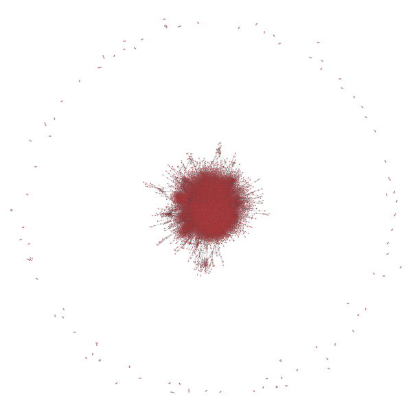


    <VertexPropertyMap object with value type 'vector<double>', for Graph 0x7fad530c14e0, at 0x7fad5917e780>


```python
kcore_threshold = gt.kcore_decomposition(g_threshold)
gt.graph_draw(g_threshold, vertex_fill_color=kcore_threshold, vertex_text=kcore_threshold)
```


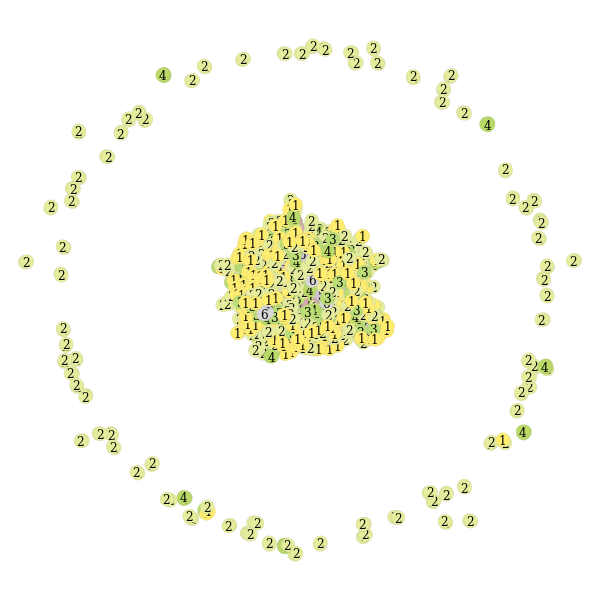


    <VertexPropertyMap object with value type 'vector<double>', for Graph 0x7fad530c14e0, at 0x7fad5311d588>


```python
pos_threshold = gt.radial_tree_layout(g_threshold, g_threshold.vertex(0))
gt.graph_draw(g_threshold, pos=pos_threshold)
```


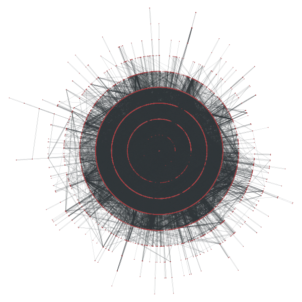


    <VertexPropertyMap object with value type 'vector<double>', for Graph 0x7fad530c14e0, at 0x7fad4a4b6e10>


```python
state_threshold = gt.minimize_nested_blockmodel_dl(g_threshold, deg_corr=True)
gt.draw_hierarchy(state_threshold)
```


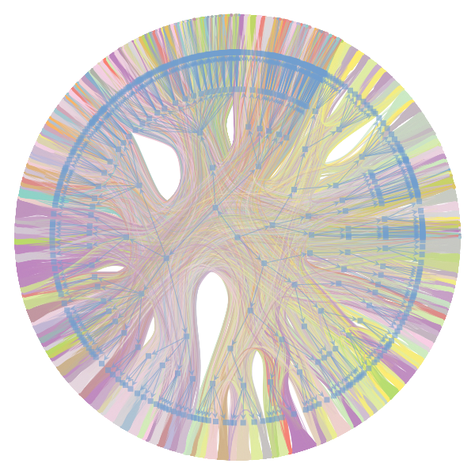


    (<VertexPropertyMap object with value type 'vector<double>', for Graph 0x7fad530c14e0, at 0x7fad5857e7f0>,
     <Graph object, directed, with 14936 vertices and 14935 edges at 0x7fad4a37a908>,
     <VertexPropertyMap object with value type 'vector<double>', for Graph 0x7fad4a37a908, at 0x7fad4a502f98>)


### Artifical Friendship Network (defined by all of meetup alters)


```python
gt.graph_draw(g_all)
```


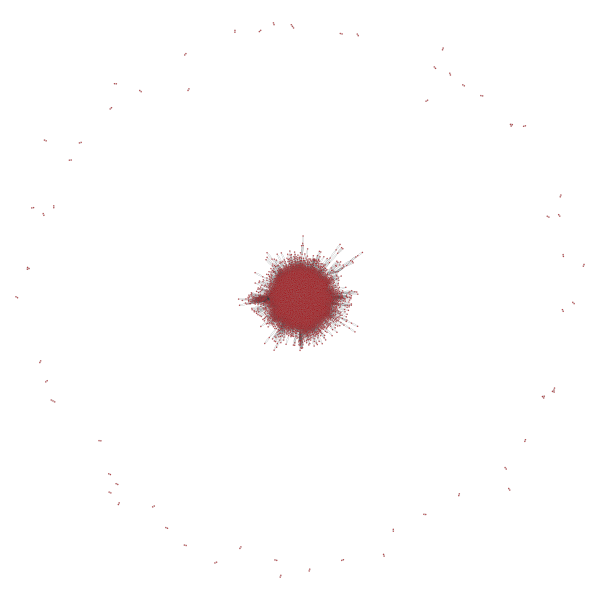


    <VertexPropertyMap object with value type 'vector<double>', for Graph 0x7fad5857eda0, at 0x7fad4a686550>


```python
kcore_all = gt.kcore_decomposition(g_all)
gt.graph_draw(g_all, vertex_fill_color=kcore_all, vertex_text=kcore_all)
```


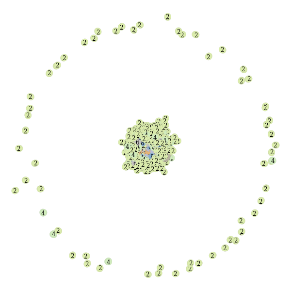


    <VertexPropertyMap object with value type 'vector<double>', for Graph 0x7fad5857eda0, at 0x7fad5858eeb8>


```python
pos_all = gt.radial_tree_layout(g_all, g_all.vertex(0))
gt.graph_draw(g_all, pos=pos_all)
```


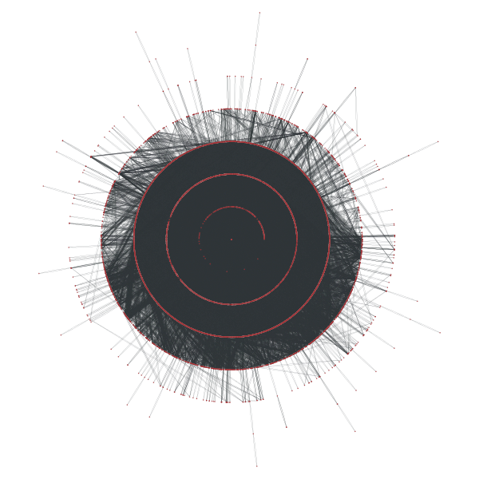


    <VertexPropertyMap object with value type 'vector<double>', for Graph 0x7fad5857eda0, at 0x7fad4a48c860>


```python
state_all = gt.minimize_nested_blockmodel_dl(g_all, deg_corr=True)
gt.draw_hierarchy(state_all)
```


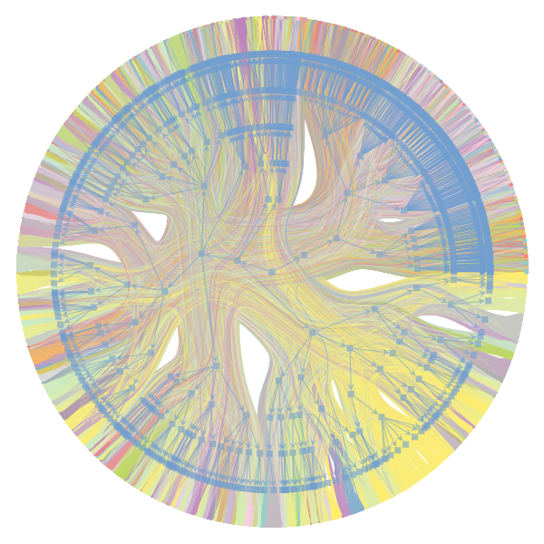


    (<VertexPropertyMap object with value type 'vector<double>', for Graph 0x7fad5857eda0, at 0x7fad4a32b278>,
     <Graph object, directed, with 15758 vertices and 15757 edges at 0x7fad4a502630>,
     <VertexPropertyMap object with value type 'vector<double>', for Graph 0x7fad4a502630, at 0x7fad4a502b00>)


```python
# print(g2.vp.keys())
# print(g2.ep.keys())
# print([g2.vp['name'][v] for v in g2.get_vertices()])
```

## Compare with different friendship network

In its default parametrization, the adjacency similarity is the sum of equal non-zero entries in the adjacency matrix, given a vertex ordering determined by the vertex labels. In other words, it counts the number of edges which have the same source and target labels in both graphs. This function also allows for generalized similarities according to an $L^p$ norm, for arbitrary p.


```python
print(gt.similarity(g_true,g_all,p=1), gt.similarity(g_true,g_threshold,p=1), gt.similarity(g_threshold,g_all,p=1))
```

    0.008505080190397247 0.009080255219410565 0.013178097513854289
    


```python
print(gt.similarity(g_true,g_all,p=2), gt.similarity(g_true,g_threshold,p=2), gt.similarity(g_threshold,g_all,p=2))
```

    0.9984218810372317 0.9971980719162166 0.9984366189294781
    


```python

```


```python

```
