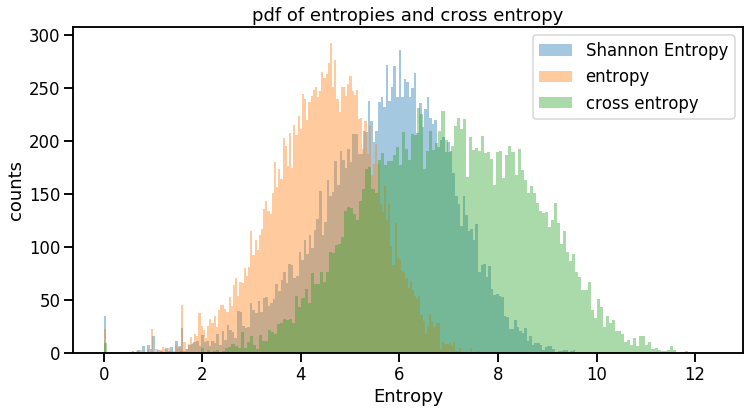
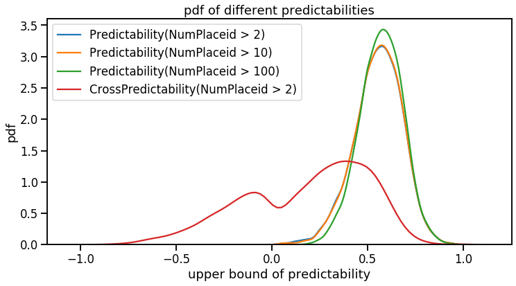
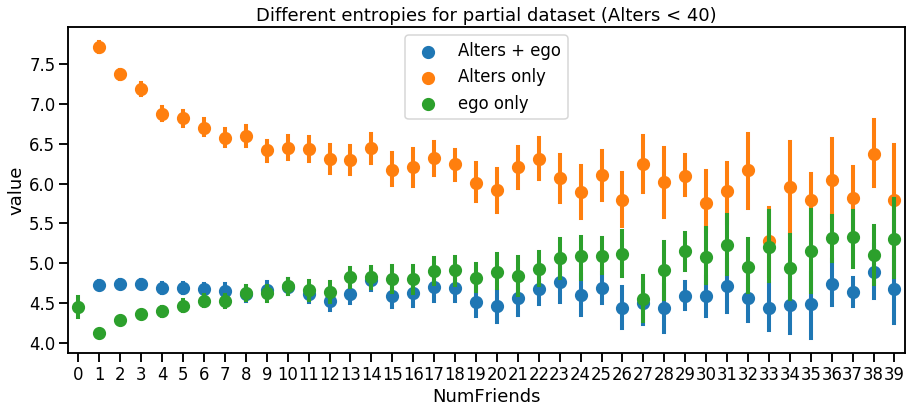
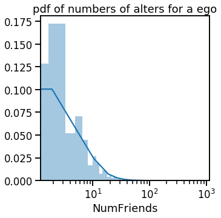
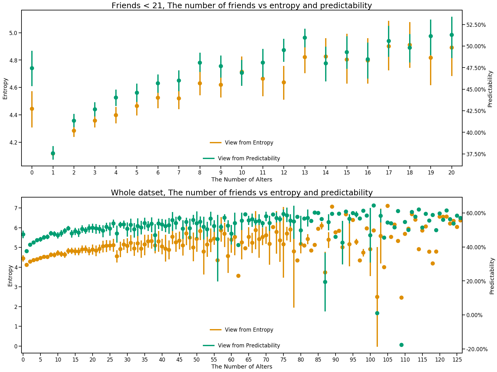
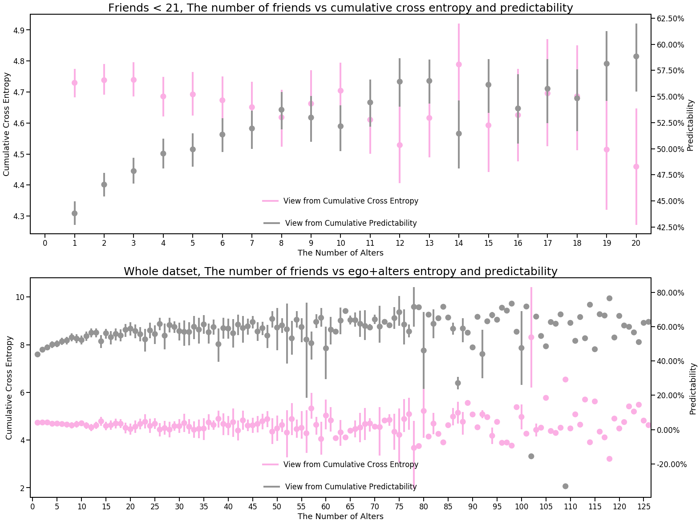
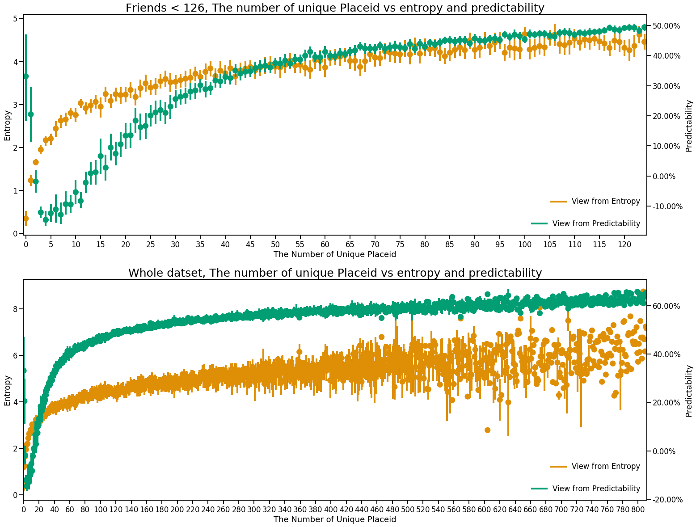
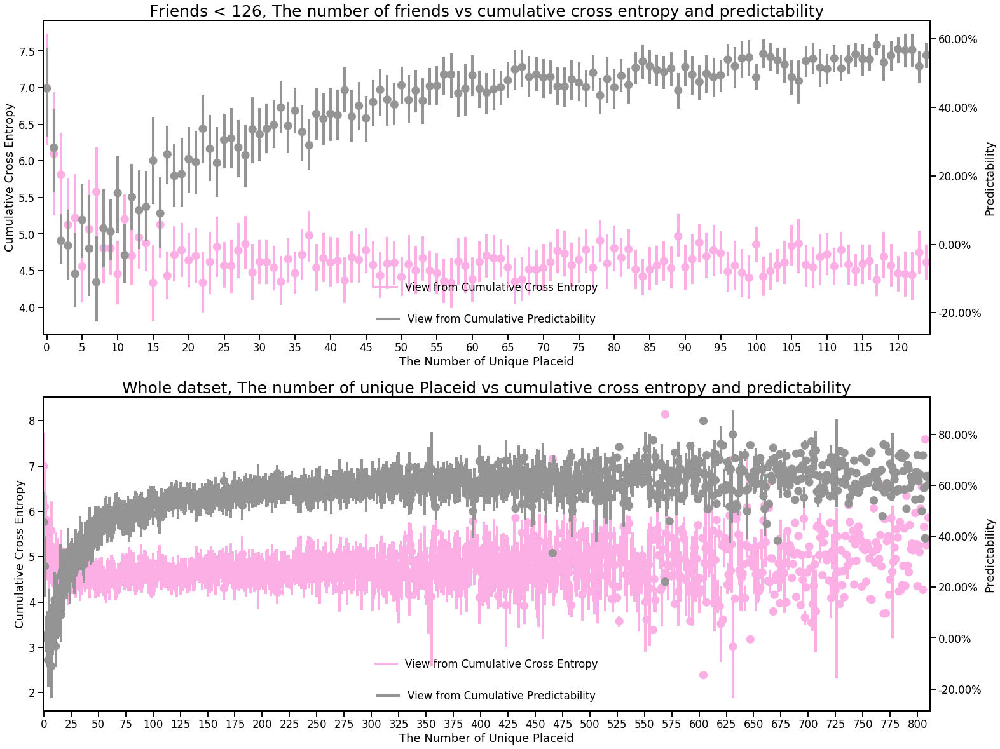
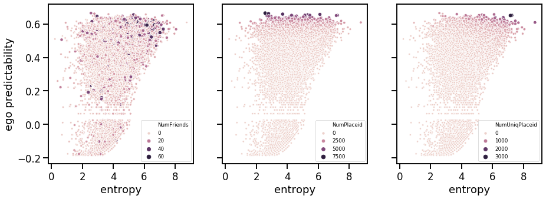
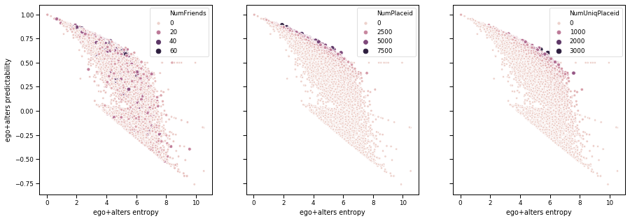

# Social information capture following Bagrow's paper: Visualisation


```python
import numpy as np
import pandas as pd
import matplotlib.pyplot as plt
%matplotlib inline
import matplotlib.colors as colors
import pickle
```


```python
# read picle file
pickle_in = open("user_info.pickle", "rb")
user_info = pickle.load(pickle_in)
```


```python
user_details = pd.DataFrame.from_dict(user_info, orient='index',
                       columns=['NumPlaceid','NumUniqPlaceid', 'NumFriends',
                                'ShannonEntropy', 'entropy', 
                                'ego predictability', 'ego+alters entropy', 'alters entropy',
                                'ego+alters predictability', 'alters predictability'])
```


```python
user_details
```


<div>
<style scoped>
    .dataframe tbody tr th:only-of-type {
        vertical-align: middle;
    }

    .dataframe tbody tr th {
        vertical-align: top;
    }

    .dataframe thead th {
        text-align: right;
    }
</style>
<table border="1" class="dataframe">
  <thead>
    <tr style="text-align: right;">
      <th></th>
      <th>NumPlaceid</th>
      <th>NumUniqPlaceid</th>
      <th>NumFriends</th>
      <th>ShannonEntropy</th>
      <th>entropy</th>
      <th>ego predictability</th>
      <th>ego+alters entropy</th>
      <th>alters entropy</th>
      <th>ego+alters predictability</th>
      <th>alters predictability</th>
    </tr>
  </thead>
  <tbody>
    <tr>
      <td>eric-pakurar</td>
      <td>490</td>
      <td>161</td>
      <td>6</td>
      <td>5.436017</td>
      <td>4.174407</td>
      <td>0.527459</td>
      <td>3.947835</td>
      <td>6.808230</td>
      <td>0.661459</td>
      <td>0.341607</td>
    </tr>
    <tr>
      <td>sean-weller</td>
      <td>427</td>
      <td>250</td>
      <td>4</td>
      <td>7.271467</td>
      <td>5.875851</td>
      <td>0.516850</td>
      <td>4.813549</td>
      <td>5.294403</td>
      <td>0.562125</td>
      <td>0.508329</td>
    </tr>
    <tr>
      <td>david-mckinney</td>
      <td>353</td>
      <td>105</td>
      <td>4</td>
      <td>4.980373</td>
      <td>2.319584</td>
      <td>0.501224</td>
      <td>2.754077</td>
      <td>10.230040</td>
      <td>0.767017</td>
      <td>-0.227473</td>
    </tr>
    <tr>
      <td>uwe-r</td>
      <td>297</td>
      <td>97</td>
      <td>7</td>
      <td>5.348942</td>
      <td>4.272597</td>
      <td>0.485968</td>
      <td>4.942620</td>
      <td>9.526083</td>
      <td>0.519611</td>
      <td>-0.176695</td>
    </tr>
    <tr>
      <td>markus-windisch</td>
      <td>310</td>
      <td>126</td>
      <td>7</td>
      <td>5.196615</td>
      <td>4.247680</td>
      <td>0.489854</td>
      <td>4.216728</td>
      <td>4.653284</td>
      <td>0.607075</td>
      <td>0.557184</td>
    </tr>
    <tr>
      <td>...</td>
      <td>...</td>
      <td>...</td>
      <td>...</td>
      <td>...</td>
      <td>...</td>
      <td>...</td>
      <td>...</td>
      <td>...</td>
      <td>...</td>
      <td>...</td>
    </tr>
    <tr>
      <td>lynsey-smith</td>
      <td>2742</td>
      <td>652</td>
      <td>4</td>
      <td>7.318507</td>
      <td>5.143958</td>
      <td>0.626460</td>
      <td>4.482729</td>
      <td>8.160845</td>
      <td>0.686083</td>
      <td>0.368566</td>
    </tr>
    <tr>
      <td>gary-clapp</td>
      <td>125</td>
      <td>47</td>
      <td>11</td>
      <td>4.893416</td>
      <td>3.737009</td>
      <td>0.388017</td>
      <td>4.566568</td>
      <td>6.647187</td>
      <td>0.487065</td>
      <td>0.120457</td>
    </tr>
    <tr>
      <td>tracey-b</td>
      <td>349</td>
      <td>152</td>
      <td>2</td>
      <td>6.056782</td>
      <td>4.657239</td>
      <td>0.500250</td>
      <td>4.835907</td>
      <td>8.789491</td>
      <td>0.544975</td>
      <td>-0.050938</td>
    </tr>
    <tr>
      <td>donald-koroh</td>
      <td>213</td>
      <td>150</td>
      <td>3</td>
      <td>6.924772</td>
      <td>5.862965</td>
      <td>0.453192</td>
      <td>5.306294</td>
      <td>6.514254</td>
      <td>0.441480</td>
      <td>0.264994</td>
    </tr>
    <tr>
      <td>henrique-plutarco</td>
      <td>499</td>
      <td>102</td>
      <td>1</td>
      <td>4.453547</td>
      <td>3.201493</td>
      <td>0.528822</td>
      <td>3.836486</td>
      <td>11.513234</td>
      <td>0.673526</td>
      <td>-0.305923</td>
    </tr>
  </tbody>
</table>
<p>15793 rows × 10 columns</p>
</div>


```python
import seaborn as sns
import matplotlib.ticker as ticker
palette = sns.color_palette("colorblind")
```

## Distributions of Entropies and Cumulative Cross Entropy


```python
fig, ax = plt.subplots(figsize = (12,6))
sns.set_context('talk')
sns.distplot(user_details['ShannonEntropy'], label='Shannon Entropy', kde=False, bins=200)
sns.distplot(user_details['entropy'], label = 'entropy',  kde=False, bins=200)
sns.distplot(user_details['alters entropy'], label='cross entropy',  kde=False, bins=200)
plt.title('pdf of entropies and cross entropy')
ax.set(xlabel='Entropy', ylabel='counts')
ax.legend()
plt.show()
```





## Distributions of predictabilities

PS: Maybe incorrect because I'm still thinking what does mean of negative predictability


```python
fig, ax = plt.subplots(figsize = (12,6))
sns.set_context('talk')
sns.distplot(user_details['ego predictability'], label='ego', bins = 200, kde=False)
sns.distplot(user_details['alters predictability'], label='alters only', bins=200, kde=False)
sns.distplot(user_details['ego+alters predictability'], label = 'ego+alters', bins=200, kde=False)
plt.title('pdf of predictabilities')
ax.set(xlabel='predictability', ylabel='counts')
ax.legend()
plt.show()
```





## Entropies and predictabilities compare


```python
CCE = pd.melt(user_details, id_vars=['NumFriends'], value_vars=['ego+alters entropy','alters entropy','entropy'], \
                  var_name = 'entropy')
```


```python
fig, ax = plt.subplots(figsize=(15, 6))
sns.set_context("talk")
sns.pointplot(x="NumFriends", y="value", hue='entropy', data=CCE[CCE['NumFriends'] < 40], \
              ci=95, join=False, ax=ax)
leg_handles = ax.get_legend_handles_labels()[0]
ax.legend(leg_handles, ['Alters + ego', 'Alters only', 'ego only'], loc=9)
plt.title('Different entropies for partial dataset (Alters < 40)')
```


    Text(0.5, 1.0, 'Different entropies for partial dataset (Alters < 40)')





```python
baseline = user_details[user_details['NumFriends'] ==0]['ego predictability'].mean()
```


```python
CCE_pred = pd.melt(user_details, id_vars=['NumFriends'], value_vars=['ego+alters predictability','alters predictability', 'ego predictability'], \
                  var_name = 'predictability')
CCE_pred
```


<div>
<style scoped>
    .dataframe tbody tr th:only-of-type {
        vertical-align: middle;
    }

    .dataframe tbody tr th {
        vertical-align: top;
    }

    .dataframe thead th {
        text-align: right;
    }
</style>
<table border="1" class="dataframe">
  <thead>
    <tr style="text-align: right;">
      <th></th>
      <th>NumFriends</th>
      <th>predictability</th>
      <th>value</th>
    </tr>
  </thead>
  <tbody>
    <tr>
      <td>0</td>
      <td>6</td>
      <td>ego+alters predictability</td>
      <td>0.661459</td>
    </tr>
    <tr>
      <td>1</td>
      <td>4</td>
      <td>ego+alters predictability</td>
      <td>0.562125</td>
    </tr>
    <tr>
      <td>2</td>
      <td>4</td>
      <td>ego+alters predictability</td>
      <td>0.767017</td>
    </tr>
    <tr>
      <td>3</td>
      <td>7</td>
      <td>ego+alters predictability</td>
      <td>0.519611</td>
    </tr>
    <tr>
      <td>4</td>
      <td>7</td>
      <td>ego+alters predictability</td>
      <td>0.607075</td>
    </tr>
    <tr>
      <td>...</td>
      <td>...</td>
      <td>...</td>
      <td>...</td>
    </tr>
    <tr>
      <td>47374</td>
      <td>4</td>
      <td>ego predictability</td>
      <td>0.626460</td>
    </tr>
    <tr>
      <td>47375</td>
      <td>11</td>
      <td>ego predictability</td>
      <td>0.388017</td>
    </tr>
    <tr>
      <td>47376</td>
      <td>2</td>
      <td>ego predictability</td>
      <td>0.500250</td>
    </tr>
    <tr>
      <td>47377</td>
      <td>3</td>
      <td>ego predictability</td>
      <td>0.453192</td>
    </tr>
    <tr>
      <td>47378</td>
      <td>1</td>
      <td>ego predictability</td>
      <td>0.528822</td>
    </tr>
  </tbody>
</table>
<p>47379 rows × 3 columns</p>
</div>


```python
fig, ax = plt.subplots(figsize=(15, 6))
sns.set_context("talk")
sns.pointplot(x="NumFriends", y="value", hue='predictability', data=CCE_pred[CCE_pred['NumFriends'] < 40], \
              ci=95, join=False, ax=ax)
ax.axhline(y=baseline, color='black')
handles, _ = ax.get_legend_handles_labels()
plt.legend(handles, ['Alters + ego', 'Alters only', 'ego only'])

vals = ax.get_yticks()
ax.set_yticklabels(['{:,.2%}'.format(x) for x in vals])
ax.xaxis.set_major_locator(ticker.MultipleLocator(5))
ax.xaxis.set_major_formatter(ticker.ScalarFormatter())
ax.set(xlabel='The number of alters each ego has', ylabel='Predictability')


plt.title('Different predictabilities for partial dataset (Alters < 40)')
```


    Text(0.5, 1.0, 'Different predictabilities for partial dataset (Alters < 40)')


```python

```

## Baisc statistics for number of friends, average alters for a ego is 7.22


```python
user_details['NumFriends'].describe()
```


    count    15793.000000
    mean         7.225416
    std         15.002240
    min          0.000000
    25%          2.000000
    50%          4.000000
    75%          8.000000
    max        821.000000
    Name: NumFriends, dtype: float64


```python
fig, ax = plt.subplots(figsize=(5, 5))
sns.distplot(user_details['NumFriends'], bins=500)
ax.set_xscale('log')
plt.title('pdf of numbers of alters for a ego')
plt.show()
```





## Baisc statistics for number of placeid (average 466.64) and unique placeid (average 167)


```python
user_details['NumPlaceid'].describe()
```


    count    15793.000000
    mean       466.644209
    std        509.988549
    min          1.000000
    25%        138.000000
    50%        316.000000
    75%        621.000000
    max       7338.000000
    Name: NumPlaceid, dtype: float64


```python
user_details['NumUniqPlaceid'].describe()
```


    count    15793.000000
    mean       167.005572
    std        154.044074
    min          1.000000
    25%         62.000000
    50%        125.000000
    75%        226.000000
    max       2470.000000
    Name: NumUniqPlaceid, dtype: float64


```python
# SMALL_SIZE = 15
# MEDIUM_SIZE = 20
# BIGGER_SIZE = 25

# plt.rc('font', size=SMALL_SIZE)          # controls default text sizes
# plt.rc('axes', titlesize=SMALL_SIZE)     # fontsize of the axes title
# plt.rc('axes', labelsize=MEDIUM_SIZE)    # fontsize of the x and y labels
# plt.rc('xtick', labelsize=SMALL_SIZE)    # fontsize of the tick labels
# plt.rc('ytick', labelsize=SMALL_SIZE)    # fontsize of the tick labels
# plt.rc('legend', fontsize=SMALL_SIZE)    # legend fontsize
# plt.rc('figure', titlesize=BIGGER_SIZE)  # fontsize of the figure title
```

## The number of friends (alters) VS entropy and predictability


```python
fig, [ax, ax3] = plt.subplots(2,1, figsize=(25, 20))
sns.set_context("talk")
sns.pointplot(x="NumFriends", y="entropy", data=user_details[user_details['NumFriends'] < 21], \
              ci=95, join=False, ax=ax, color=palette[1])
ax.legend(labels=['View from Entropy'], bbox_to_anchor=(0., .1, 1., .1), loc=8, frameon=False)
ax.set(xlabel='The Number of Alters', ylabel='Entropy')

ax2 = ax.twinx()
sns.pointplot(x="NumFriends", y="ego predictability", data=user_details[user_details['NumFriends'] < 21], \
              ci=95, join=False, ax=ax2, color=palette[2])
ax2.legend(labels=['View from Predictability'], bbox_to_anchor=(0., 0, 1., .1), loc=8, frameon=False)

vals = ax2.get_yticks()
ax2.set_yticklabels(['{:,.2%}'.format(x) for x in vals])
ax2.set(xlabel='The Number of Alters', ylabel='Predictability')

plt.title('Friends < 21, The number of friends vs entropy and predictability', fontsize=25)

sns.pointplot(x="NumFriends", y="entropy", data=user_details, \
              ci=95, join=False, ax=ax3, color=palette[1])
ax3.set(xlabel='The Number of Alters', ylabel='Entropy')
ax3.legend(labels=['View from Entropy'], bbox_to_anchor=(0., .1, 1., .1), loc=8, frameon=False)

ax4 = ax3.twinx()
sns.pointplot(x="NumFriends", y="ego predictability", data=user_details, \
              ci=95, join=False, ax=ax4, color=palette[2])
ax4.legend(labels=['View from Predictability'], bbox_to_anchor=(0., 0, 1., .1), loc=8, frameon=False)

vals = ax4.get_yticks()
ax4.set_yticklabels(['{:,.2%}'.format(x) for x in vals])
ax4.xaxis.set_major_locator(ticker.MultipleLocator(5))
ax4.xaxis.set_major_formatter(ticker.ScalarFormatter())
ax4.set(xlabel='The Number of Alters', ylabel='Predictability')

plt.title('Whole datset, The number of friends vs entropy and predictability', fontsize=25)
plt.show()
```





## The number of friends (alters) VS cumulative cross entropy and predictability (estimated by cumulative cross entropy)


```python
fig, [ax, ax3] = plt.subplots(2,1, figsize=(25, 20))
sns.set_context("talk")
sns.pointplot(x="NumFriends", y="ego+alters entropy", data=user_details[user_details['NumFriends'] < 21], \
              ci=95, join=False, ax=ax, color=palette[6])
ax.legend(labels=['View from Cumulative Cross Entropy'], bbox_to_anchor=(0., .1, 1., .1), loc=8, frameon=False)
ax.set(xlabel='The Number of Alters', ylabel='Cumulative Cross Entropy')

ax2 = ax.twinx()
sns.pointplot(x="NumFriends", y="ego+alters predictability", data=user_details[user_details['NumFriends'] < 21], \
              ci=95, join=False, ax=ax2, color=palette[7])
ax2.legend(labels=['View from Cumulative Predictability'], bbox_to_anchor=(0., 0, 1., .1), loc=8, frameon=False)

vals = ax2.get_yticks()
ax2.set_yticklabels(['{:,.2%}'.format(x) for x in vals])
ax2.set(xlabel='The Number of Alters', ylabel='Predictability')

plt.title('Friends < 21, The number of friends vs cumulative cross entropy and predictability', fontsize=25)

sns.pointplot(x="NumFriends", y="ego+alters entropy", data=user_details, \
              ci=95, join=False, ax=ax3, color=palette[6])
ax3.set(xlabel='The Number of Alters', ylabel='Cumulative Cross Entropy')
ax3.legend(labels=['View from Cumulative Cross Entropy'], bbox_to_anchor=(0., .1, 1., .1), loc=8, frameon=False)

ax4 = ax3.twinx()
sns.pointplot(x="NumFriends", y="ego+alters predictability", data=user_details, \
              ci=95, join=False, ax=ax4, color=palette[7])
ax4.legend(labels=['View from Cumulative Predictability'], bbox_to_anchor=(0., 0, 1., .1), loc=8, frameon=False)

vals = ax4.get_yticks()
ax4.set_yticklabels(['{:,.2%}'.format(x) for x in vals])
ax4.xaxis.set_major_locator(ticker.MultipleLocator(5))
ax4.xaxis.set_major_formatter(ticker.ScalarFormatter())
ax4.set(xlabel='The Number of Alters', ylabel='Predictability')

plt.title('Whole datset, The number of friends vs ego+alters entropy and predictability', fontsize=25)
plt.show()
```





## The number of Unique Placeid VS entropy and predictability


```python
fig, [ax, ax3] = plt.subplots(2,1, figsize=(25, 20))
sns.set_context("talk")
sns.pointplot(x="NumUniqPlaceid", y="entropy", data=user_details[user_details['NumUniqPlaceid'] < 126], \
              ci=95, join=False, ax=ax, color=palette[1])
ax.legend(labels=['View from Entropy'], bbox_to_anchor=(0., .1, 1., .1), loc=1, frameon=False)
ax.set(xlabel='The Number of Unique Placeid', ylabel='Entropy')

ax2 = ax.twinx()
sns.pointplot(x="NumUniqPlaceid", y="ego predictability", data=user_details[user_details['NumUniqPlaceid'] < 126], \
              ci=95, join=False, ax=ax2, color=palette[2])
ax2.legend(labels=['View from Predictability'], bbox_to_anchor=(0., 0, 1., .1), loc=1, frameon=False)

vals = ax2.get_yticks()
ax2.set_yticklabels(['{:,.2%}'.format(x) for x in vals])
ax2.xaxis.set_major_locator(ticker.MultipleLocator(5))
ax2.xaxis.set_major_formatter(ticker.ScalarFormatter())
ax2.set(xlabel='The Number of Unique Placeid', ylabel='Predictability')

plt.title('Friends < 126, The number of unique Placeid vs entropy and predictability', fontsize=25)

sns.pointplot(x="NumUniqPlaceid", y="entropy", data=user_details, \
              ci=95, join=False, ax=ax3, color=palette[1])
ax3.set(xlabel='The Number of Unique Placeid', ylabel='Entropy')
ax3.legend(labels=['View from Entropy'], bbox_to_anchor=(0., .1, 1., .1), loc=1, frameon=False)

ax4 = ax3.twinx()
sns.pointplot(x="NumUniqPlaceid", y="ego predictability", data=user_details, \
              ci=95, join=False, ax=ax4, color=palette[2])
ax4.legend(labels=['View from Predictability'], bbox_to_anchor=(0., 0, 1., .1), loc=1, frameon=False)

vals = ax4.get_yticks()
ax4.set_yticklabels(['{:,.2%}'.format(x) for x in vals])
ax4.xaxis.set_major_locator(ticker.MultipleLocator(20))
ax4.xaxis.set_major_formatter(ticker.ScalarFormatter())
ax4.set(xlabel='The Number of Unique Placeid', ylabel='Predictability')

plt.title('Whole datset, The number of unique Placeid vs entropy and predictability', fontsize=25)
plt.show()
```





## The number of Unique Placeid VS cumulative cross entropy and predictability (estimated by cumulative cross entropy)

PS: This section may not correct because I'm still thinking what does mean of negative predictability


```python
fig, [ax, ax3] = plt.subplots(2,1, figsize=(25, 20))
sns.set_context("talk")
sns.pointplot(x="NumUniqPlaceid", y="ego+alters entropy", data=user_details[user_details['NumUniqPlaceid'] < 126], \
              ci=95, join=False, ax=ax, color=palette[6])
ax.legend(labels=['View from Cumulative Cross Entropy'], bbox_to_anchor=(0., .1, 1., .1), loc=8, frameon=False)
ax.set(xlabel='The Number of Unique Placeid', ylabel='Cumulative Cross Entropy')

ax2 = ax.twinx()
sns.pointplot(x="NumUniqPlaceid", y="ego+alters predictability", data=user_details[user_details['NumUniqPlaceid'] < 126], \
              ci=95, join=False, ax=ax2, color=palette[7])
ax2.legend(labels=['View from Cumulative Predictability'], bbox_to_anchor=(0., 0, 1., .1), loc=8, frameon=False)

vals = ax2.get_yticks()
ax2.set_yticklabels(['{:,.2%}'.format(x) for x in vals])
ax2.xaxis.set_major_locator(ticker.MultipleLocator(5))
ax2.xaxis.set_major_formatter(ticker.ScalarFormatter())
ax2.set(xlabel='The Number of Unique Placeid', ylabel='Predictability')

plt.title('Friends < 126, The number of friends vs cumulative cross entropy and predictability', fontsize=25)

sns.pointplot(x="NumUniqPlaceid", y="ego+alters entropy", data=user_details, \
              ci=95, join=False, ax=ax3, color=palette[6])
ax3.set(xlabel='The Number of Unique Placeid', ylabel='Cumulative Cross Entropy')
ax3.legend(labels=['View from Cumulative Cross Entropy'], bbox_to_anchor=(0., .1, 1., .1), loc=8, frameon=False)

ax4 = ax3.twinx()
sns.pointplot(x="NumUniqPlaceid", y="ego+alters predictability", data=user_details, \
              ci=95, join=False, ax=ax4, color=palette[7])
ax4.legend(labels=['View from Cumulative Predictability'], bbox_to_anchor=(0., 0, 1., .1), loc=8, frameon=False)

vals = ax4.get_yticks()
ax4.set_yticklabels(['{:,.2%}'.format(x) for x in vals])
ax4.xaxis.set_major_locator(ticker.MultipleLocator(25))
ax4.xaxis.set_major_formatter(ticker.ScalarFormatter())
ax4.set(xlabel='The Number of Unique Placeid', ylabel='Predictability')

plt.title('Whole datset, The number of unique Placeid vs cumulative cross entropy and predictability', fontsize=25)
plt.show()
```





## Entropy vs Predictability along with number of friend, placeid and unique placeid


```python
fig, [ax1, ax2, ax3] = plt.subplots(1,3, figsize=(15, 5), sharey=True)
sns.set_context("paper")
sns.scatterplot(x="entropy", y="ego predictability", data=user_details[user_details['NumFriends'] < 50], \
           hue="NumFriends", size="NumFriends", ax=ax1)
sns.scatterplot(x="entropy", y="ego predictability", data=user_details[user_details['NumFriends'] < 50], \
           hue="NumPlaceid", size="NumPlaceid", ax=ax2)
sns.scatterplot(x="entropy", y="ego predictability", data=user_details[user_details['NumFriends'] < 50], \
           hue="NumUniqPlaceid", size="NumUniqPlaceid", ax=ax3)
plt.show()
```





```python
fig, [ax1, ax2, ax3] = plt.subplots(1,3, figsize=(15, 5), sharey=True)
sns.set_context("paper")
sns.scatterplot(x="ego+alters entropy", y="ego+alters predictability", data=user_details[user_details['NumFriends'] < 50], \
           hue="NumFriends", size="NumFriends", ax=ax1)
sns.scatterplot(x="ego+alters entropy", y="ego+alters predictability", data=user_details[user_details['NumFriends'] < 50], \
           hue="NumPlaceid", size="NumPlaceid", ax=ax2)
sns.scatterplot(x="ego+alters entropy", y="ego+alters predictability", data=user_details[user_details['NumFriends'] < 50], \
           hue="NumUniqPlaceid", size="NumUniqPlaceid", ax=ax3)
plt.show()
```





```python

```


```python

```
