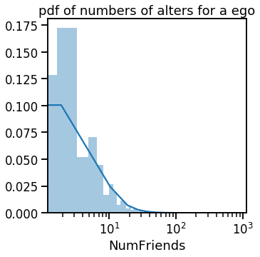
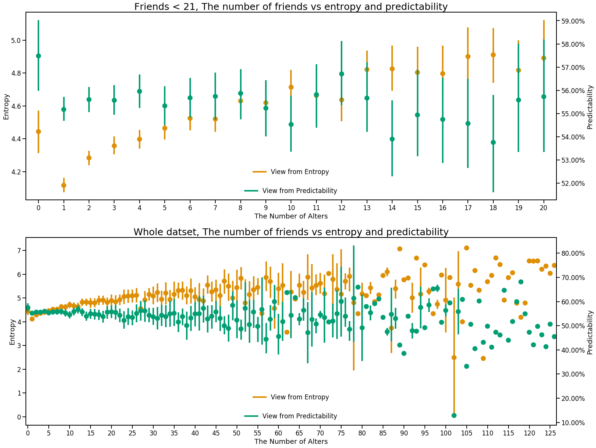
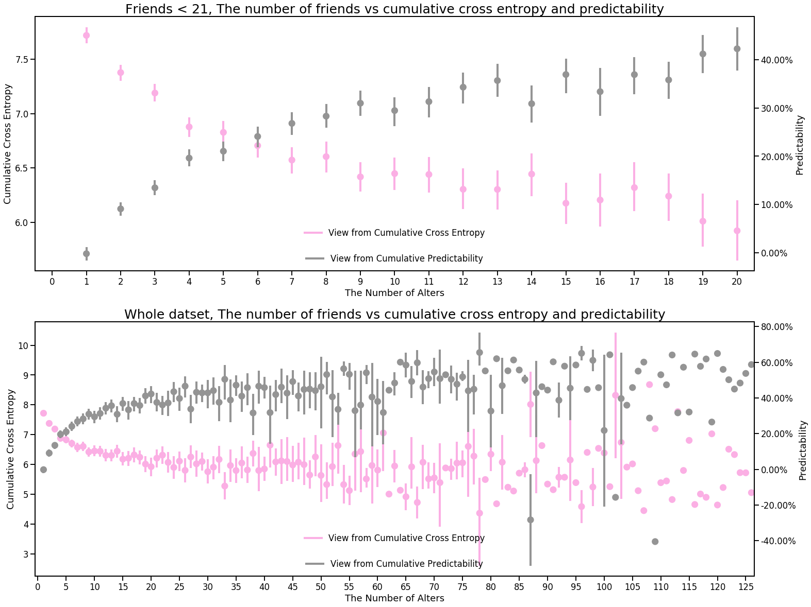
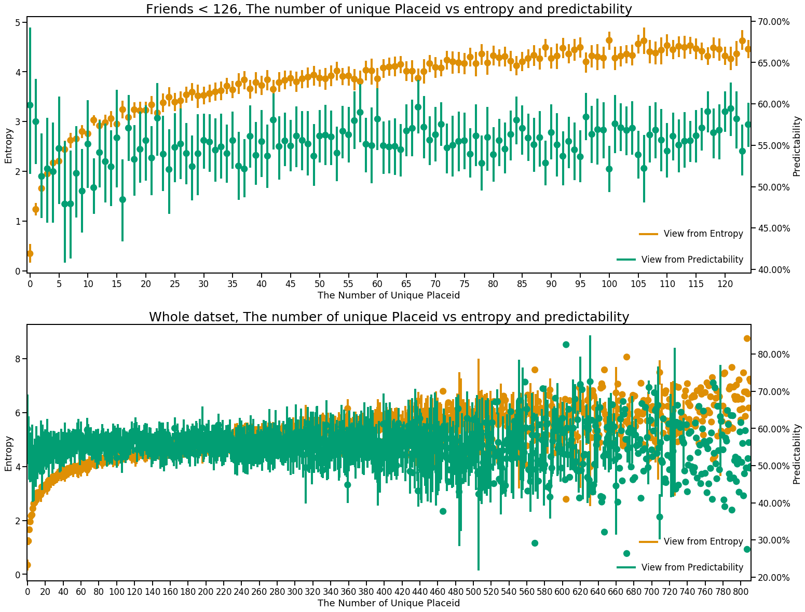
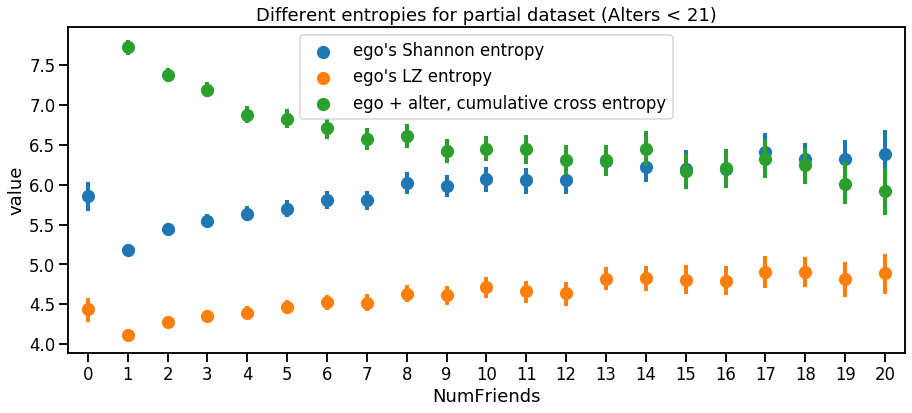
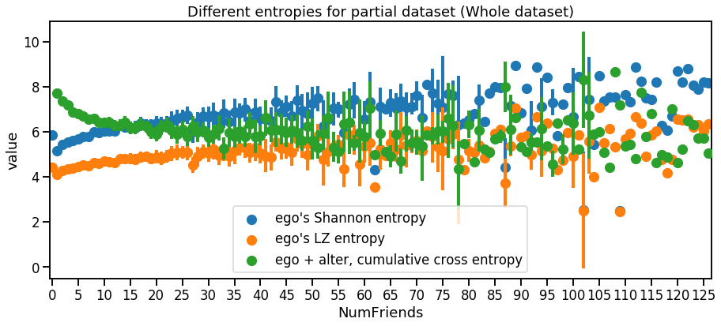
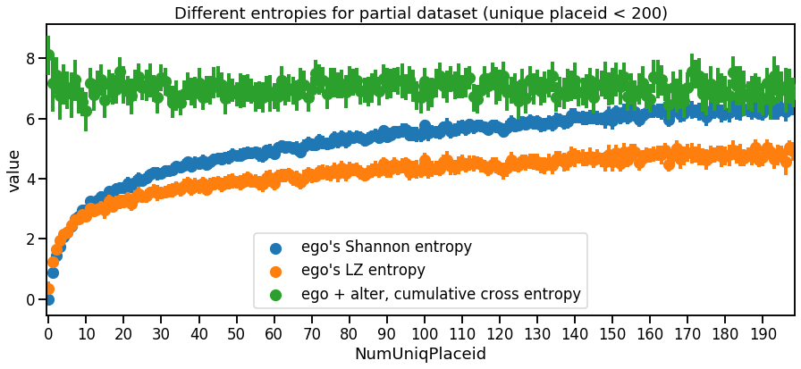
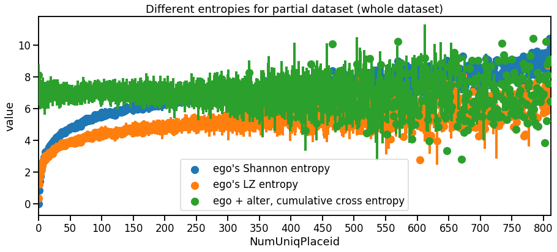
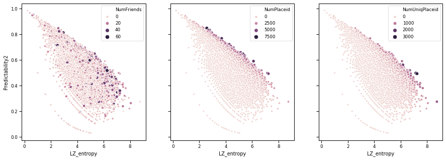
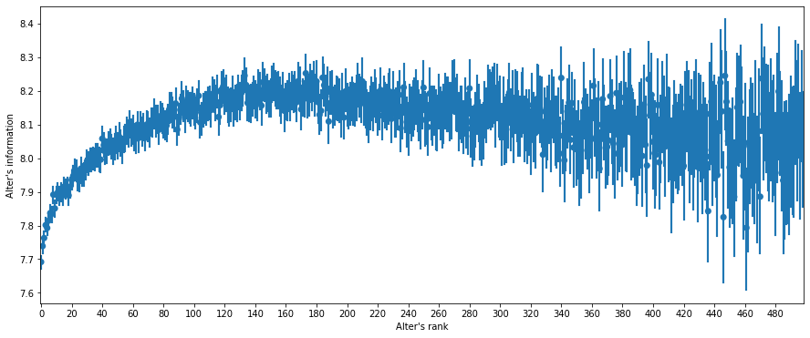

# Social information capture following Bagrow's paper: Visualisation


```python
import numpy as np
import pandas as pd
import matplotlib.pyplot as plt
%matplotlib inline
import matplotlib.colors as colors
import pickle
```


```python
# read picle file
pickle_in = open("user_info.pickle", "rb")
user_info = pickle.load(pickle_in)
```


```python
user_details = pd.DataFrame.from_dict(user_info, orient='index',
                       columns=['NumPlaceid','NumUniqPlaceid', 'NumFriends',
                                'ShannonEntropy', 'LZ_entropy', 'LZ_entropy2', 'LZ_entropy10', 'LZ_entropy100',
                                'Predictability2', 'Predictability10', 'Predictability100',
                                'CrossEntropy', 'CrossPredictability2'])
```


```python
user_details
```


<div>
<style scoped>
    .dataframe tbody tr th:only-of-type {
        vertical-align: middle;
    }

    .dataframe tbody tr th {
        vertical-align: top;
    }

    .dataframe thead th {
        text-align: right;
    }
</style>
<table border="1" class="dataframe">
  <thead>
    <tr style="text-align: right;">
      <th></th>
      <th>NumPlaceid</th>
      <th>NumUniqPlaceid</th>
      <th>NumFriends</th>
      <th>ShannonEntropy</th>
      <th>LZ_entropy</th>
      <th>LZ_entropy2</th>
      <th>LZ_entropy10</th>
      <th>LZ_entropy100</th>
      <th>Predictability2</th>
      <th>Predictability10</th>
      <th>Predictability100</th>
      <th>CrossEntropy</th>
      <th>CrossPredictability2</th>
    </tr>
  </thead>
  <tbody>
    <tr>
      <td>linus-oura</td>
      <td>202</td>
      <td>100</td>
      <td>3</td>
      <td>5.658225</td>
      <td>4.382319</td>
      <td>4.382319</td>
      <td>4.382319</td>
      <td>4.382319</td>
      <td>0.556712</td>
      <td>0.556712</td>
      <td>0.556712</td>
      <td>5.847956</td>
      <td>0.358739</td>
    </tr>
    <tr>
      <td>carlos-granier-phelps</td>
      <td>488</td>
      <td>156</td>
      <td>8</td>
      <td>5.924540</td>
      <td>4.438085</td>
      <td>4.438085</td>
      <td>4.438085</td>
      <td>4.438085</td>
      <td>0.610893</td>
      <td>0.610893</td>
      <td>0.610893</td>
      <td>6.493165</td>
      <td>0.380012</td>
    </tr>
    <tr>
      <td>brian-niedfeldt</td>
      <td>80</td>
      <td>46</td>
      <td>2</td>
      <td>5.140111</td>
      <td>4.250036</td>
      <td>4.250036</td>
      <td>4.250036</td>
      <td>NaN</td>
      <td>0.484318</td>
      <td>0.484318</td>
      <td>NaN</td>
      <td>8.039260</td>
      <td>-0.246740</td>
    </tr>
    <tr>
      <td>horacio-garay</td>
      <td>282</td>
      <td>76</td>
      <td>12</td>
      <td>3.544559</td>
      <td>2.883610</td>
      <td>2.883610</td>
      <td>2.883610</td>
      <td>2.883610</td>
      <td>0.746009</td>
      <td>0.746009</td>
      <td>0.746009</td>
      <td>3.343534</td>
      <td>0.697656</td>
    </tr>
    <tr>
      <td>ben-samples</td>
      <td>228</td>
      <td>115</td>
      <td>2</td>
      <td>6.238941</td>
      <td>5.016570</td>
      <td>5.016570</td>
      <td>5.016570</td>
      <td>5.016570</td>
      <td>0.486737</td>
      <td>0.486737</td>
      <td>0.486737</td>
      <td>7.091019</td>
      <td>0.181210</td>
    </tr>
    <tr>
      <td>...</td>
      <td>...</td>
      <td>...</td>
      <td>...</td>
      <td>...</td>
      <td>...</td>
      <td>...</td>
      <td>...</td>
      <td>...</td>
      <td>...</td>
      <td>...</td>
      <td>...</td>
      <td>...</td>
      <td>...</td>
    </tr>
    <tr>
      <td>gabriel-gonzalez</td>
      <td>39</td>
      <td>30</td>
      <td>1</td>
      <td>4.733870</td>
      <td>4.385759</td>
      <td>4.385759</td>
      <td>4.385759</td>
      <td>NaN</td>
      <td>0.340627</td>
      <td>0.340627</td>
      <td>NaN</td>
      <td>8.434628</td>
      <td>-0.440348</td>
    </tr>
    <tr>
      <td>erik-laurenceau</td>
      <td>26</td>
      <td>23</td>
      <td>3</td>
      <td>4.469670</td>
      <td>4.364694</td>
      <td>4.364694</td>
      <td>4.364694</td>
      <td>NaN</td>
      <td>0.226217</td>
      <td>0.226217</td>
      <td>NaN</td>
      <td>7.175223</td>
      <td>-0.341795</td>
    </tr>
    <tr>
      <td>juan-gabriel-aguilar</td>
      <td>241</td>
      <td>68</td>
      <td>3</td>
      <td>3.805134</td>
      <td>2.275664</td>
      <td>2.275664</td>
      <td>2.275664</td>
      <td>2.275664</td>
      <td>0.802787</td>
      <td>0.802787</td>
      <td>0.802787</td>
      <td>9.082121</td>
      <td>-0.162035</td>
    </tr>
    <tr>
      <td>darren-oriain</td>
      <td>24</td>
      <td>22</td>
      <td>1</td>
      <td>4.386842</td>
      <td>4.232273</td>
      <td>4.232273</td>
      <td>4.232273</td>
      <td>NaN</td>
      <td>0.240236</td>
      <td>0.240236</td>
      <td>NaN</td>
      <td>10.350105</td>
      <td>-0.768995</td>
    </tr>
    <tr>
      <td>marshall-manson</td>
      <td>367</td>
      <td>179</td>
      <td>25</td>
      <td>6.197457</td>
      <td>4.422499</td>
      <td>4.422499</td>
      <td>4.422499</td>
      <td>4.422499</td>
      <td>0.595018</td>
      <td>0.595018</td>
      <td>0.595018</td>
      <td>4.903376</td>
      <td>0.541054</td>
    </tr>
  </tbody>
</table>
<p>15793 rows × 13 columns</p>
</div>


```python
import seaborn as sns
import matplotlib.ticker as ticker
palette = sns.color_palette("colorblind")
```

## Distributions of Entropies and Cumulative Cross Entropy


```python
fig, ax = plt.subplots(figsize = (12,6))
sns.set_context('talk')
sns.distplot(user_details['ShannonEntropy'], label='Shannon Entropy', hist=False)
sns.distplot(user_details['CrossEntropy'], label = 'cumulative cross entropy', hist=False)
sns.distplot(user_details['LZ_entropy100'], label='LZ entropy100', hist=False)
sns.distplot(user_details['LZ_entropy10'], label='LZ entropy10', hist=False)
sns.distplot(user_details['LZ_entropy2'], label='LZ entropy2', hist=False)
sns.distplot(user_details['LZ_entropy'], label='LZ entropy', hist=False)
plt.title('pdf of entropies and cumulative cross entropy')
ax.set(xlabel='Entropy', ylabel='pdf')
plt.show()
```


## Distributions of predictabilities

PS: Maybe incorrect because I'm still thinking what does mean of negative predictability


```python
fig, ax = plt.subplots(figsize = (12,6))
sns.set_context('talk')
sns.distplot(user_details['Predictability2'], label='Predictability(NumPlaceid > 2)', hist=False)
sns.distplot(user_details['Predictability10'], label = 'Predictability(NumPlaceid > 10)', hist=False)
sns.distplot(user_details['Predictability100'], label='Predictability(NumPlaceid > 100)', hist=False)
sns.distplot(user_details['CrossPredictability2'], label='CrossPredictability(NumPlaceid > 2)', hist=False)
plt.title('pdf of different predictabilities')
ax.set(xlabel='upper bound of predictability', ylabel='pdf')
plt.show()
```


## Baisc statistics for number of friends, average alters for a ego is 7.22


```python
user_details['NumFriends'].describe()
```


    count    15793.000000
    mean         7.225416
    std         15.002240
    min          0.000000
    25%          2.000000
    50%          4.000000
    75%          8.000000
    max        821.000000
    Name: NumFriends, dtype: float64


```python
fig, ax = plt.subplots(figsize=(5, 5))
sns.distplot(user_details['NumFriends'], bins=500)
ax.set_xscale('log')
plt.title('pdf of numbers of alters for a ego')
plt.show()
```





## Baisc statistics for number of placeid (average 466.64) and unique placeid (average 167)


```python
user_details['NumPlaceid'].describe()
```


    count    15793.000000
    mean       466.644209
    std        509.988549
    min          1.000000
    25%        138.000000
    50%        316.000000
    75%        621.000000
    max       7338.000000
    Name: NumPlaceid, dtype: float64


```python
user_details['NumUniqPlaceid'].describe()
```


    count    15793.000000
    mean       167.005572
    std        154.044074
    min          1.000000
    25%         62.000000
    50%        125.000000
    75%        226.000000
    max       2470.000000
    Name: NumUniqPlaceid, dtype: float64


```python

```


```python

```


```python
# SMALL_SIZE = 15
# MEDIUM_SIZE = 20
# BIGGER_SIZE = 25

# plt.rc('font', size=SMALL_SIZE)          # controls default text sizes
# plt.rc('axes', titlesize=SMALL_SIZE)     # fontsize of the axes title
# plt.rc('axes', labelsize=MEDIUM_SIZE)    # fontsize of the x and y labels
# plt.rc('xtick', labelsize=SMALL_SIZE)    # fontsize of the tick labels
# plt.rc('ytick', labelsize=SMALL_SIZE)    # fontsize of the tick labels
# plt.rc('legend', fontsize=SMALL_SIZE)    # legend fontsize
# plt.rc('figure', titlesize=BIGGER_SIZE)  # fontsize of the figure title
```

## The number of friends (alters) VS entropy and predictability


```python
fig, [ax, ax3] = plt.subplots(2,1, figsize=(25, 20))
sns.set_context("talk")
sns.pointplot(x="NumFriends", y="LZ_entropy", data=user_details[user_details['NumFriends'] < 21], \
              ci=95, join=False, ax=ax, color=palette[1])
ax.legend(labels=['View from Entropy'], bbox_to_anchor=(0., .1, 1., .1), loc=8, frameon=False)
ax.set(xlabel='The Number of Alters', ylabel='Entropy')

ax2 = ax.twinx()
sns.pointplot(x="NumFriends", y="Predictability2", data=user_details[user_details['NumFriends'] < 21], \
              ci=95, join=False, ax=ax2, color=palette[2])
ax2.legend(labels=['View from Predictability'], bbox_to_anchor=(0., 0, 1., .1), loc=8, frameon=False)

vals = ax2.get_yticks()
ax2.set_yticklabels(['{:,.2%}'.format(x) for x in vals])
ax2.set(xlabel='The Number of Alters', ylabel='Predictability')

plt.title('Friends < 21, The number of friends vs entropy and predictability', fontsize=25)

sns.pointplot(x="NumFriends", y="LZ_entropy", data=user_details, \
              ci=95, join=False, ax=ax3, color=palette[1])
ax3.set(xlabel='The Number of Alters', ylabel='Entropy')
ax3.legend(labels=['View from Entropy'], bbox_to_anchor=(0., .1, 1., .1), loc=8, frameon=False)

ax4 = ax3.twinx()
sns.pointplot(x="NumFriends", y="Predictability2", data=user_details, \
              ci=95, join=False, ax=ax4, color=palette[2])
ax4.legend(labels=['View from Predictability'], bbox_to_anchor=(0., 0, 1., .1), loc=8, frameon=False)

vals = ax4.get_yticks()
ax4.set_yticklabels(['{:,.2%}'.format(x) for x in vals])
ax4.xaxis.set_major_locator(ticker.MultipleLocator(5))
ax4.xaxis.set_major_formatter(ticker.ScalarFormatter())
ax4.set(xlabel='The Number of Alters', ylabel='Predictability')

plt.title('Whole datset, The number of friends vs entropy and predictability', fontsize=25)
plt.show()
```





## The number of friends (alters) VS cumulative cross entropy and predictability (estimated by cumulative cross entropy)


```python
fig, [ax, ax3] = plt.subplots(2,1, figsize=(25, 20))
sns.set_context("talk")
sns.pointplot(x="NumFriends", y="CrossEntropy", data=user_details[user_details['NumFriends'] < 21], \
              ci=95, join=False, ax=ax, color=palette[6])
ax.legend(labels=['View from Cumulative Cross Entropy'], bbox_to_anchor=(0., .1, 1., .1), loc=8, frameon=False)
ax.set(xlabel='The Number of Alters', ylabel='Cumulative Cross Entropy')

ax2 = ax.twinx()
sns.pointplot(x="NumFriends", y="CrossPredictability2", data=user_details[user_details['NumFriends'] < 21], \
              ci=95, join=False, ax=ax2, color=palette[7])
ax2.legend(labels=['View from Cumulative Predictability'], bbox_to_anchor=(0., 0, 1., .1), loc=8, frameon=False)

vals = ax2.get_yticks()
ax2.set_yticklabels(['{:,.2%}'.format(x) for x in vals])
ax2.set(xlabel='The Number of Alters', ylabel='Predictability')

plt.title('Friends < 21, The number of friends vs cumulative cross entropy and predictability', fontsize=25)

sns.pointplot(x="NumFriends", y="CrossEntropy", data=user_details, \
              ci=95, join=False, ax=ax3, color=palette[6])
ax3.set(xlabel='The Number of Alters', ylabel='Cumulative Cross Entropy')
ax3.legend(labels=['View from Cumulative Cross Entropy'], bbox_to_anchor=(0., .1, 1., .1), loc=8, frameon=False)

ax4 = ax3.twinx()
sns.pointplot(x="NumFriends", y="CrossPredictability2", data=user_details, \
              ci=95, join=False, ax=ax4, color=palette[7])
ax4.legend(labels=['View from Cumulative Predictability'], bbox_to_anchor=(0., 0, 1., .1), loc=8, frameon=False)

vals = ax4.get_yticks()
ax4.set_yticklabels(['{:,.2%}'.format(x) for x in vals])
ax4.xaxis.set_major_locator(ticker.MultipleLocator(5))
ax4.xaxis.set_major_formatter(ticker.ScalarFormatter())
ax4.set(xlabel='The Number of Alters', ylabel='Predictability')

plt.title('Whole datset, The number of friends vs cumulative cross entropy and predictability', fontsize=25)
plt.show()
```





## The number of Unique Placeid VS entropy and predictability


```python
fig, [ax, ax3] = plt.subplots(2,1, figsize=(25, 20))
sns.set_context("talk")
sns.pointplot(x="NumUniqPlaceid", y="LZ_entropy", data=user_details[user_details['NumUniqPlaceid'] < 126], \
              ci=95, join=False, ax=ax, color=palette[1])
ax.legend(labels=['View from Entropy'], bbox_to_anchor=(0., .1, 1., .1), loc=1, frameon=False)
ax.set(xlabel='The Number of Unique Placeid', ylabel='Entropy')

ax2 = ax.twinx()
sns.pointplot(x="NumUniqPlaceid", y="Predictability2", data=user_details[user_details['NumUniqPlaceid'] < 126], \
              ci=95, join=False, ax=ax2, color=palette[2])
ax2.legend(labels=['View from Predictability'], bbox_to_anchor=(0., 0, 1., .1), loc=1, frameon=False)

vals = ax2.get_yticks()
ax2.set_yticklabels(['{:,.2%}'.format(x) for x in vals])
ax2.xaxis.set_major_locator(ticker.MultipleLocator(5))
ax2.xaxis.set_major_formatter(ticker.ScalarFormatter())
ax2.set(xlabel='The Number of Unique Placeid', ylabel='Predictability')

plt.title('Friends < 126, The number of unique Placeid vs entropy and predictability', fontsize=25)

sns.pointplot(x="NumUniqPlaceid", y="LZ_entropy", data=user_details, \
              ci=95, join=False, ax=ax3, color=palette[1])
ax3.set(xlabel='The Number of Unique Placeid', ylabel='Entropy')
ax3.legend(labels=['View from Entropy'], bbox_to_anchor=(0., .1, 1., .1), loc=1, frameon=False)

ax4 = ax3.twinx()
sns.pointplot(x="NumUniqPlaceid", y="Predictability2", data=user_details, \
              ci=95, join=False, ax=ax4, color=palette[2])
ax4.legend(labels=['View from Predictability'], bbox_to_anchor=(0., 0, 1., .1), loc=1, frameon=False)

vals = ax4.get_yticks()
ax4.set_yticklabels(['{:,.2%}'.format(x) for x in vals])
ax4.xaxis.set_major_locator(ticker.MultipleLocator(20))
ax4.xaxis.set_major_formatter(ticker.ScalarFormatter())
ax4.set(xlabel='The Number of Unique Placeid', ylabel='Predictability')

plt.title('Whole datset, The number of unique Placeid vs entropy and predictability', fontsize=25)
plt.show()
```





## The number of Unique Placeid VS cumulative cross entropy and predictability (estimated by cumulative cross entropy)

PS: This section may not correct because I'm still thinking what does mean of negative predictability


```python
fig, [ax, ax3] = plt.subplots(2,1, figsize=(25, 20))
sns.set_context("talk")
sns.pointplot(x="NumUniqPlaceid", y="CrossEntropy", data=user_details[user_details['NumUniqPlaceid'] < 126], \
              ci=95, join=False, ax=ax, color=palette[6])
ax.legend(labels=['View from Cumulative Cross Entropy'], bbox_to_anchor=(0., .1, 1., .1), loc=8, frameon=False)
ax.set(xlabel='The Number of Unique Placeid', ylabel='Cumulative Cross Entropy')

ax2 = ax.twinx()
sns.pointplot(x="NumUniqPlaceid", y="CrossPredictability2", data=user_details[user_details['NumUniqPlaceid'] < 126], \
              ci=95, join=False, ax=ax2, color=palette[7])
ax2.legend(labels=['View from Cumulative Predictability'], bbox_to_anchor=(0., 0, 1., .1), loc=8, frameon=False)

vals = ax2.get_yticks()
ax2.set_yticklabels(['{:,.2%}'.format(x) for x in vals])
ax2.xaxis.set_major_locator(ticker.MultipleLocator(5))
ax2.xaxis.set_major_formatter(ticker.ScalarFormatter())
ax2.set(xlabel='The Number of Unique Placeid', ylabel='Predictability')

plt.title('Friends < 126, The number of friends vs cumulative cross entropy and predictability', fontsize=25)

sns.pointplot(x="NumUniqPlaceid", y="CrossEntropy", data=user_details, \
              ci=95, join=False, ax=ax3, color=palette[6])
ax3.set(xlabel='The Number of Unique Placeid', ylabel='Cumulative Cross Entropy')
ax3.legend(labels=['View from Cumulative Cross Entropy'], bbox_to_anchor=(0., .1, 1., .1), loc=8, frameon=False)

ax4 = ax3.twinx()
sns.pointplot(x="NumUniqPlaceid", y="CrossPredictability2", data=user_details, \
              ci=95, join=False, ax=ax4, color=palette[7])
ax4.legend(labels=['View from Cumulative Predictability'], bbox_to_anchor=(0., 0, 1., .1), loc=8, frameon=False)

vals = ax4.get_yticks()
ax4.set_yticklabels(['{:,.2%}'.format(x) for x in vals])
ax4.xaxis.set_major_locator(ticker.MultipleLocator(25))
ax4.xaxis.set_major_formatter(ticker.ScalarFormatter())
ax4.set(xlabel='The Number of Unique Placeid', ylabel='Predictability')

plt.title('Whole datset, The number of unique Placeid vs cumulative cross entropy and predictability', fontsize=25)
plt.show()
```


## The number of friends (alters) VS entropy and cumulative cross entropy


```python
SLC_melt = pd.melt(user_details, id_vars=['NumFriends'], value_vars=['ShannonEntropy', 'LZ_entropy', 'CrossEntropy'], \
                  var_name = 'entropy')
SLC_melt
```


<div>
<style scoped>
    .dataframe tbody tr th:only-of-type {
        vertical-align: middle;
    }

    .dataframe tbody tr th {
        vertical-align: top;
    }

    .dataframe thead th {
        text-align: right;
    }
</style>
<table border="1" class="dataframe">
  <thead>
    <tr style="text-align: right;">
      <th></th>
      <th>NumFriends</th>
      <th>entropy</th>
      <th>value</th>
    </tr>
  </thead>
  <tbody>
    <tr>
      <td>0</td>
      <td>3</td>
      <td>ShannonEntropy</td>
      <td>5.658225</td>
    </tr>
    <tr>
      <td>1</td>
      <td>8</td>
      <td>ShannonEntropy</td>
      <td>5.924540</td>
    </tr>
    <tr>
      <td>2</td>
      <td>2</td>
      <td>ShannonEntropy</td>
      <td>5.140111</td>
    </tr>
    <tr>
      <td>3</td>
      <td>12</td>
      <td>ShannonEntropy</td>
      <td>3.544559</td>
    </tr>
    <tr>
      <td>4</td>
      <td>2</td>
      <td>ShannonEntropy</td>
      <td>6.238941</td>
    </tr>
    <tr>
      <td>...</td>
      <td>...</td>
      <td>...</td>
      <td>...</td>
    </tr>
    <tr>
      <td>47374</td>
      <td>1</td>
      <td>CrossEntropy</td>
      <td>8.434628</td>
    </tr>
    <tr>
      <td>47375</td>
      <td>3</td>
      <td>CrossEntropy</td>
      <td>7.175223</td>
    </tr>
    <tr>
      <td>47376</td>
      <td>3</td>
      <td>CrossEntropy</td>
      <td>9.082121</td>
    </tr>
    <tr>
      <td>47377</td>
      <td>1</td>
      <td>CrossEntropy</td>
      <td>10.350105</td>
    </tr>
    <tr>
      <td>47378</td>
      <td>25</td>
      <td>CrossEntropy</td>
      <td>4.903376</td>
    </tr>
  </tbody>
</table>
<p>47379 rows × 3 columns</p>
</div>


```python
fig, ax = plt.subplots(figsize=(15, 6))
sns.set_context("talk")
sns.pointplot(x="NumFriends", y="value", hue='entropy', data=SLC_melt[SLC_melt['NumFriends'] < 21], \
              ci=95, join=False, ax=ax)
leg_handles = ax.get_legend_handles_labels()[0]
ax.legend(leg_handles, ['ego\'s Shannon entropy' , 'ego\'s LZ entropy', 'ego + alter, cumulative cross entropy'], loc=9)
plt.title('Different entropies for partial dataset (Alters < 21)')
```


    Text(0.5, 1.0, 'Different entropies for partial dataset (Alters < 21)')





```python
fig, ax = plt.subplots(figsize=(15, 6))
sns.set_context("talk")
sns.pointplot(x="NumFriends", y="value", hue='entropy', data=SLC_melt, \
              ci=95, join=False, ax=ax)
leg_handles = ax.get_legend_handles_labels()[0]
ax.legend(leg_handles, ['ego\'s Shannon entropy' , 'ego\'s LZ entropy', 'ego + alter, cumulative cross entropy'], loc=8)
ax.xaxis.set_major_locator(ticker.MultipleLocator(5))
ax.xaxis.set_major_formatter(ticker.ScalarFormatter())
plt.title('Different entropies for partial dataset (Whole dataset)')
```


    Text(0.5, 1.0, 'Different entropies for partial dataset (Whole dataset)')





## The number of unique placeid vs entropy and cumulative cross entropy


```python
uniq_pl_melt = pd.melt(user_details, id_vars=['NumUniqPlaceid'], value_vars=['ShannonEntropy', 'LZ_entropy', 'CrossEntropy'], \
                  var_name = 'entropy')

fig, ax = plt.subplots(figsize=(15, 6))
sns.set_context("talk")
sns.pointplot(x="NumUniqPlaceid", y="value", hue='entropy', data=uniq_pl_melt[uniq_pl_melt['NumUniqPlaceid'] < 200], \
              ci=95, join=False, ax=ax)
leg_handles = ax.get_legend_handles_labels()[0]
ax.legend(leg_handles, ['ego\'s Shannon entropy' , 'ego\'s LZ entropy', 'ego + alter, cumulative cross entropy'], loc=8)
ax.xaxis.set_major_locator(ticker.MultipleLocator(10))
ax.xaxis.set_major_formatter(ticker.ScalarFormatter())

plt.title('Different entropies for partial dataset (unique placeid < 200)')
```


    Text(0.5, 1.0, 'Different entropies for partial dataset (unique placeid < 200)')





```python
fig, ax = plt.subplots(figsize=(15, 6))
sns.set_context("talk")
sns.pointplot(x="NumUniqPlaceid", y="value", hue='entropy', data=uniq_pl_melt, \
              ci=95, join=False, ax=ax)
leg_handles = ax.get_legend_handles_labels()[0]
ax.legend(leg_handles, ['ego\'s Shannon entropy' , 'ego\'s LZ entropy', 'ego + alter, cumulative cross entropy'], loc=8)
ax.xaxis.set_major_locator(ticker.MultipleLocator(50))
ax.xaxis.set_major_formatter(ticker.ScalarFormatter())

plt.title('Different entropies for partial dataset (whole dataset)')
```


    Text(0.5, 1.0, 'Different entropies for partial dataset (whole dataset)')





```python

```


```python

```


```python

```

## Entropy vs Predictability along with number of friend, placeid and unique placeid


```python
fig, [ax1, ax2, ax3] = plt.subplots(1,3, figsize=(15, 5), sharey=True)
sns.set_context("paper")
sns.scatterplot(x="LZ_entropy", y="Predictability2", data=user_details[user_details['NumFriends'] < 50], \
           hue="NumFriends", size="NumFriends", ax=ax1)
sns.scatterplot(x="LZ_entropy", y="Predictability2", data=user_details[user_details['NumFriends'] < 50], \
           hue="NumPlaceid", size="NumPlaceid", ax=ax2)
sns.scatterplot(x="LZ_entropy", y="Predictability2", data=user_details[user_details['NumFriends'] < 50], \
           hue="NumUniqPlaceid", size="NumUniqPlaceid", ax=ax3)
plt.show()
```





```python
fig, [ax1, ax2, ax3] = plt.subplots(1,3, figsize=(15, 5), sharey=True)
sns.set_context("paper")
sns.scatterplot(x="CrossEntropy", y="Predictability2", data=user_details[user_details['NumFriends'] < 50], \
           hue="NumFriends", size="NumFriends", ax=ax1)
sns.scatterplot(x="CrossEntropy", y="Predictability2", data=user_details[user_details['NumFriends'] < 50], \
           hue="NumPlaceid", size="NumPlaceid", ax=ax2)
sns.scatterplot(x="CrossEntropy", y="Predictability2", data=user_details[user_details['NumFriends'] < 50], \
           hue="NumUniqPlaceid", size="NumUniqPlaceid", ax=ax3)
plt.show()
```





```python

```


```python

```
